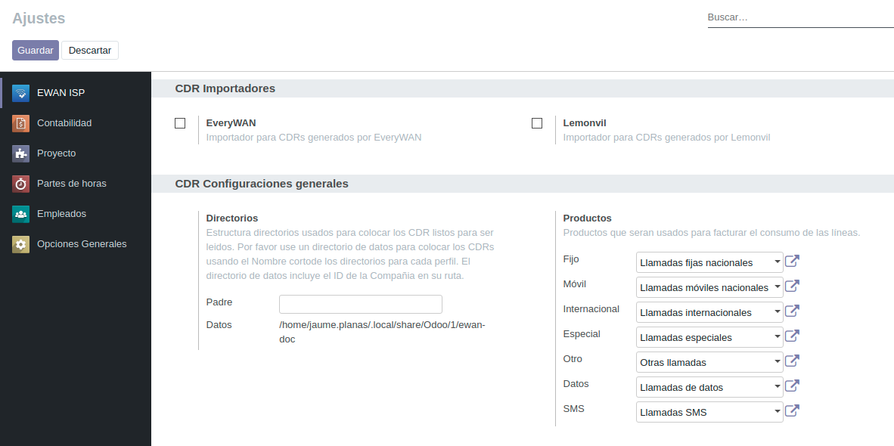

.. _config_settings:

#######
Ajustes
#######

En el menú :xmenu:`ISP/Ajustes/Ajustes`, se configuran las siguientes opciones
del vertical ISP:

CDR Importadores
   En esta sección se muestran los módulos de importación de ficheros CDR disponibles
   en el sistema. Para activarlos y utilizarlos en los :ref:`perfiles de importación <llamadas_perfiles>`,
   marque las correspondientes casillas y haga clic en **Guardar**.

CDR Configuraciones generales - Directorios
   En esta sección puede configurar un subdirectorio opcional para la gestión
   de los ficheros CDR importados en el sistema de archivos. En **Datos** se muestra
   la vía de acceso completa en el sistema de archivos del servidor.

CDR Configuraciones generales - Productos
   En esta sección se seleccionan los productos que se utilizarán en las
   líneas de detalle para facturar los consumos de los distintos tipos de llamadas.

