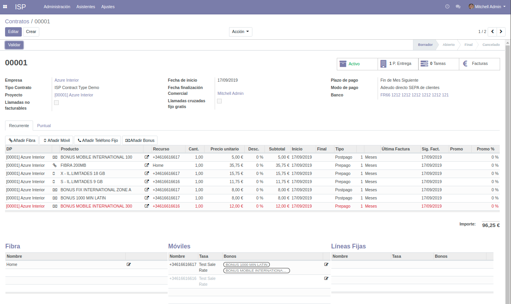

.. _contrato_contrato:

#########
Contratos
#########

En un Contrato se definen los siguientes campos más importantes:

Empresa
   Identifica la persona o entidad jurídica a la que se facturarán los consumos y servicios prestados.

:ref:`Tipo de contrato <contrato_tipo>`
   Tipo de contrato que se utilizará.

Fecha de inicio
   Fecha de alta del contrato, es un valor obligatorio.

Fecha finalización
   Fecha de baja del contrato, puede dejarse en blanco mientras esté activo el contrato.

Comercial
   Usuario del sistema que será el contacto comercial para este contrato.

Banco
   Banco en el que se efectuará el adeudo de las facturas.

Proyecto
   Al crear un contrato, se crea automáticamente un proyecto para poder
   gestionar tareas o incidencias relacionadas con este contrato.
   Es el vínculo para integrar el módulo estándard de Proyectos de Odoo en los contratos ISP.

Los contratos tienen un `Estado` (borrador, abierto, final, cancelado).

.. warning::

   Para que un contrato pueda generar facturas, debe tener el estado **Abierto** o válido.
   Para poder validar un contrato, deben cumplirse ciertas condiciones como:

   * Tener definido una cuenta bancaria con un mandato SEPA válido.
   * Tener definido un proyecto.
   * Todos los recursos asociados deben tener el estado `Abierto` o `Cancelado`.

.. _contrato_dp:

Puntos de entrega
=================

Un contrato tiene uno o varios **Puntos de entrega**. Un Punto de entrega es básicamente una dirección de instalación.

.. _contrato_linea:

Líneas de contrato
==================

Las líneas de contrato son los productos o servicios recurrentes, es decir, que se facturarán periódicamente (cada mes, por ejemplo, o cada año).

Una línea de contrato depende o está asignada a un *Punto de entrega*.

.. _contrato_puntual:

El tipo de línea de contrato más habitual es la recurrente, aunque también pueden definirse líneas **Puntuales**.
Estas líneas son el equivalente de una línea recurrente con periodicidad *Una vez*.
Sirven para definir cargos puntuales a incluir en la siguiente factura emitida.
Por ejemplo, una ampliación de datos de un móvil, una alta de servicio, devolución de un cargo indebido anterior, etc.

Cada línea de contrato mantiene un histórico de facturas.

Recurrente
----------

Los campos más importantes de las líneas de contrato recurrentes son los siguientes.

Punto de entrega
   Punto de entrega o dirección de instalación al que pertenece.

Producto
   Concepto que se factura. Toma del maestro de productos los siguientes campos:

   .. hlist::
      :columns: 3

      * Nombre
      * Descripción
      * Precio unitario
      * Tipo de pago: Prepago o Postpago
      * Intervalo
      * Unidad de intervalo

   Estos campos pueden modificarse por cada línea, además de la cantidad y el descuento.
   El `Subtotal` es un campo calculado a partir de la información anterior.

Descripción
   Descripción de la línea de contrato, que se mostrará en las facturas.

Fecha de inicio
   Fecha de alta a partir de la cual puede facturarse esta línea de contrato.

Fecha de finalización
   Si se define, no podrá facturarse a partir de dicha fecha.

Activo
   Permite detener la facturación de la línea de contrato.
   Solamente se facturan líneas de contrato activas.

Además, incluye los siguientes campos informativos que no pueden editarse:

Fecha última factura
   Fecha de la última factura que incluye esta línea de contrato.

Fecha próxima factura
   Fecha a partir de la cual vence el período actual y debe facturarse de nuevo.

Última factura desde / hasta
   Período facturado en la última factura.

Por último, permite definir dos campos para la gestión de promociones:

Fecha fin promo
   Fecha hasta la cual se aplicará el descuento de promoción.
   A partir de esta fecha, se aplicará el descuento definido en la línea de contrato.

   .. warning::

      Esta fecha es *absoluta*: define una fecha concreta del calendario.
      No es un intervalo, por ejemplo durante 2 meses.

Descuento promo
   Descuento que se aplicará hasta la fecha de finalización de la promoción.

.. _contrato_recurso:

Recursos
========

Las líneas de contrato tienen `Recursos` asignados. Todos los recursos tienen un **Estado**.
El Estado puede ser: Borrador, Abierto, Cancelado.

.. warning::

   Para poder facturar un contrato, éste tiene que estar en el estado **Abierto** o validado.
   Para poder validar un contrato, todos sus recursos asociados deben tener el estado **Abierto**.

Existen 3 tipos de recursos:

:xfa:`chain` Fibra
   Despliegue de fibra. Contiene los siguientes campos:

   * **Nombre**: por ejemplo, `Hogar` u `Oficina`.
   * **Número de serie del router**

:xfa:`mobile` Móvil
   Teléfono móvil. Contiene los siguientes campos:

   * **Número**:
   * **Tarifa**: tarifa que se aplicará a las llamadas realizadas por este móvil.
   * **Bonos**: bonos que se aplicarán a las llamadas realizadas por este móvil.
   * **SIM**: campo informativo.
   * **Número SIM**: campo informativo.
   * **PUK**: campo informativo.

:xfa:`phone` Línea fija
   Teléfono fijo. Contiene los siguientes campos:

   * **Número**:
   * **Tarifa**: tarifa que se aplicará a las llamadas realizadas por este fijo.
   * **Bonos**: bonos que se aplicarán a las llamadas realizadas por este fijo.

.. note::

   A efectos de auditoría, los recursos mantienen un histórico de cambios de titularidad o tarifa.

.. note::

   La aplicación utiliza la recomendación E.164 para el formato de números de teléfono,
   es decir, un signo `+`, seguido del código de país y del número local.

   Por ejemplo: `+34931234567`

.. _contrato_recurso_pool:

Agrupaciones de recursos
========================

Las agrupaciones de recursos permiten agrupar recursos en los cuales se aplicarán bonos comunes.

En una agrupación se definen los siguientes campos:

Contrato
   Una agrupación depende de un contrato, que define su dominio de recursos susceptibles de ser agrupados.

Recursos
   Lista de recursos que incluye una agrupación.

Bonos
   Lista de bonos que se aplicarán al conjunto de recursos agrupados.

.. warning::

   Los recursos seleccionados en una agrupación no pueden tener asignados bonos propios
   y no podrán seleccionarse en la lista de recursos disponibles.

   Dicho de otro modo, un recurso no puede tener asignados bonos propios si forma parte de una agrupación.
   El sistema no lo permitirá y se emitirá un mensaje de error.

.. _contrato_tipo:

Tipos de contrato
=================

   Un tipo de contrato es una categoría personalizable de contrato,
   que permite su categorización y definición de valores por defecto:

   * **Llamadas cruzadas fijo gratis**: Si se marca, las llamadas entre teléfonos fijos que pertenezcan
     ambos a un contrato se facturarán con un coste 0, al entenderse que no saldrán de la centralita.
   * **Diario**: Diario de ventas a efectos de contabilidad
   * **Secuencia**: Secuencia de numeración de los contratos. Cada contrato puede tener una secuencia de numeración distinta,
     que se definirá en el tipo de contrato.
   * **Plazo de pago**: Plazos de pago de las facturas emitidas. Odoo permite definir pagos parciales con fechas distintas.
   * **Modo de pago**: Los más comunes son Débito directo SEPA, Transferencia, Manual, etc.
   * **Padre analítico**: Elemento del árbol de cuentas analíticas a partir del cual se crearán las cuentas analíticas (proyectos) de cada contrato.
