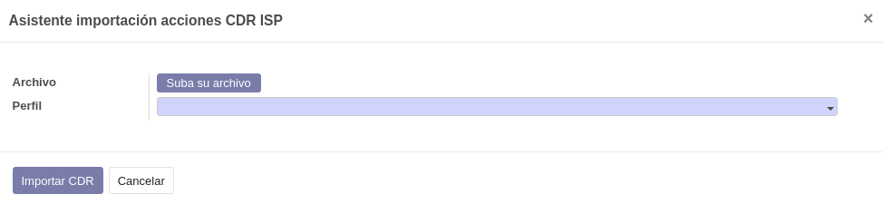

.. _procedure_cdr:

############
Importar CDR
############

Habitualmente, la importación de ficheros CDR se realiza mediante un
:ref:`proceso <llamadas_cdr>` que se ejecuta en segundo plano, denominado *cron*.

No obstante, a veces puede ser necesario importar ficheros CDR concretos,
ya sea por su no disponibilidad en los servidores de los proveedores,
fallos del sistema o cualquier otro motivo.

**EWAN-ISP** incluye un asistente que permite importar un fichero CDR a la vez.

Haga clic en el menú :xmenu:`ISP/Asistentes/Importar CDR`.

:gui:`Suba su archivo`
   Seleccione un fichero CDR existente en el sistema de archivos local.

:gui:`Perfil`
   Seleccione un :ref:`perfil de importación <llamadas_perfiles>` existente.

Haga clic en :gui:`Importar CDR`.

Se importará el fichero y se crearán las llamadas en la base de datos.

.. note::

   Este proceso no actualiza el campo :gui:`Último CDR leído` de los perfiles de importación.

.. warning::

   Este proceso no detectará si las llamadas ya se han importado con anterioridad.
   Debe asegurarse de que no existen o probablemente se duplicarán llamadas.
