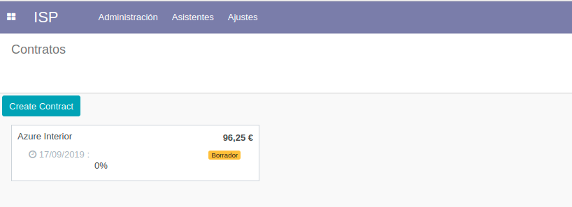
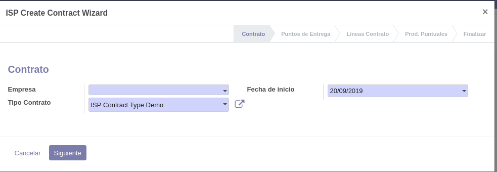
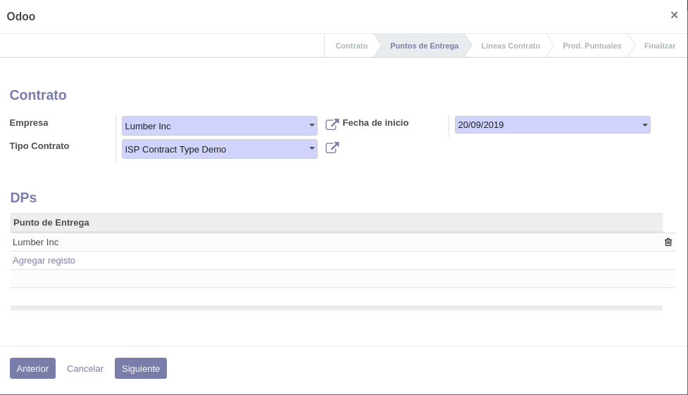
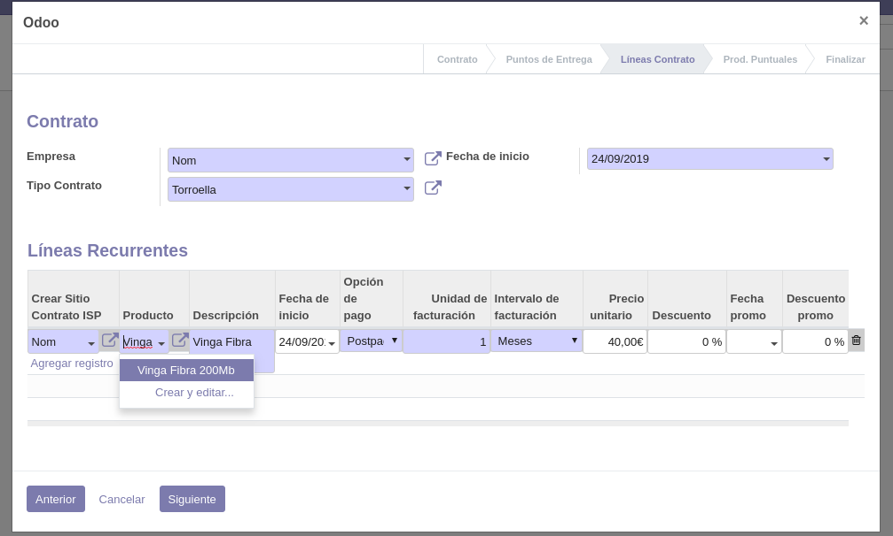
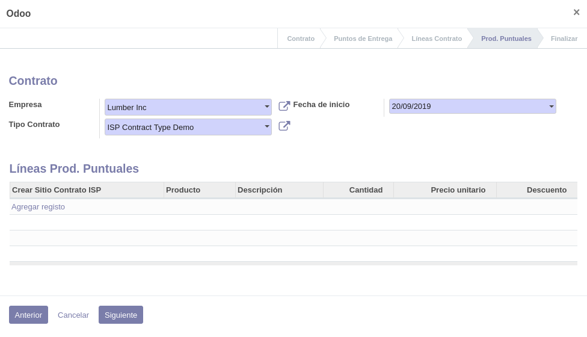
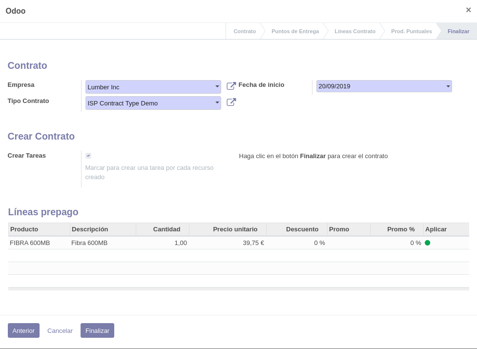
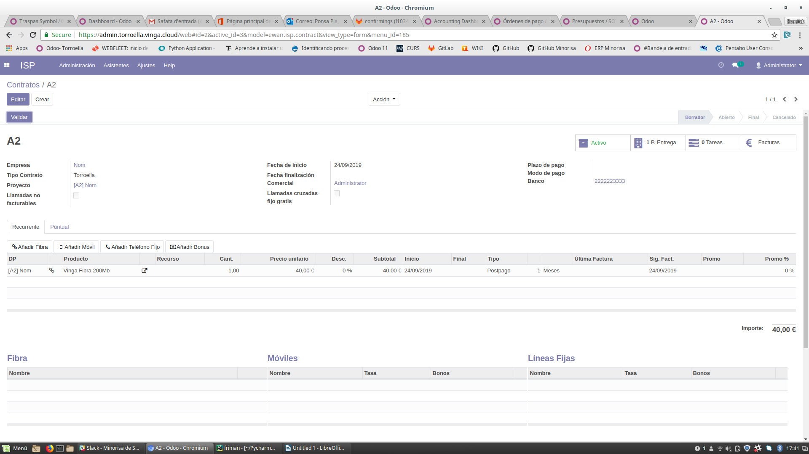

.. _procedure_contrato:

#####################
Creación de contratos
#####################

La creación o alta de contratos se realiza mediante la ayuda de un asistente
para facilitar la creación de la estructura subyacente.

En el menú :xmenu:`ISP/Administración/Contratos` se muestran los contratos
actualmente definidos.

Haga clic en el botón :gui:`Crear contrato` para abrir el asistente de creación de contratos.

Contrato
--------

En la parte superior derecha se muestra una barra de progreso con las diferentes
etapas del asistente.

+  En :gui:`Empresa` seleccione el cliente con el que desee trabajar en el desplegable.
   La última opción del desplegable es :gui:`Crear y editar`, que le permite crear un cliente
   si aún no existe.

   Si el cliente no existe, deberá crearlo:

   +  Haga clic en la opción :gui:`Crear y editar` del desplegable de :gui:`Empresa`.

   +  Se abre una ficha de cliente nuevo:

      .. image:: img/proc_contract_2a.png
         :width: 80 %
         :align: center

   +  Rellene como mínimo los campos obligatorios (los campos con un fondo de color azul).

   +  En el apartado :gui:`Banco` debe especificar como mínimo una cuenta bancaria.
      Haga clic en :gui:`Agregar registro`. Se añade una fila en la lista.

      +  En la columna :gui:`Banco`, seleccione el banco en el desplegable.
         Si no lo encuentra, puede dejarse en blanco, ya que es un campo opcional.
      +  En la columna :gui:`Número de cuenta`, escriba el número de cuenta.
         Si desea efectuar domiciliaciones SEPA, este número de cuenta deberá
         ser un número **IBAN** correcto.

   +  Haga clic en :gui:`Guardar`.

+  Nos aparece por defecto un :gui:`Tipo de contrato`: si es necesario, puede seleccionar otro.

+  En :gui:`Fecha de inicio` especifique la fecha de alta del contrato.
   Por defecto se selecciona la fecha de hoy.

+  Haga clic en :gui:`Siguiente`.

Puntos de Entrega
-----------------

En la cabecera se muestran los datos de la primera pantalla, que también se irán mostrando
en todas las pantallas del asistente.

En esta pantalla se definen los puntos de entrega. Por defecto se crea uno,
cuya dirección de instalación es la misma que la del cliente principal.
Puede modificar este punto de entrega o crear direcciones nuevas.

   +  Si desea modificar los datos del punto de entrega creado por defecto,
      o bien desea crear un nuevo punto de entrega, seleccione :gui:`Agregar registro`
      en la lista del apartado :gui:`DPs`.
   +  La ficha que se abre es similar a la de creación de cliente nuevo, pero
      esta vez sin los datos de cuenta bancaria.

Haga clic en :gui:`Siguiente`.

Líneas Contrato
---------------

En esta pantalla se definen las líneas de contrato de cada uno de los puntos de
entrega creados en el paso anterior.

Seleccione o especifique los siguientes campos:

   +  :gui:`Punto de entrega`. Por defecto se muestra el primer punto de entrega
      creado en la pantalla anterior.
   +  :gui:`Producto`.
   +  :gui:`Descripción`. Por defecto se toma la descripción del producto seleccionado.
      Puede editarla para esta línea de contrato concreta.
   +  :gui:`Fecha de inicio`. Fecha de alta del servicio. Por defecto toma la fecha
      de inicio del *contrato* (definida en la parte superior de la pantalla).
      Puede ser una fecha posterior a la fecha de inicio del contrato, pero
      nunca anterior.
   +  :gui:`Opción de pago`. `Prepago` o `Postpago`. Por defecto la del producto.
   +  :gui:`Unidad de facturación`. Número de intervalos de facturación. Por defecto la del producto.
   +  :gui:`Intervalo de facturación`. `Meses` o `Años`. Por defecto la del producto.
   +  :gui:`Precio unitario` (precio lista). Por defecto el del producto.
   +  :gui:`Descuento`. Descuento sobre el precio lista que se aplicará de forma recurrente.
   +  :gui:`Fecha promo` (opcional). Fecha final de vigencia de la promoción.

      .. warning::

         Debe especificarse la fecha del último día del período de promoción.

   +  :gui:`Descuento promo`. Descuento que se aplicará sobre el precio de lista
      durante el período de promoción. Una vez finalizado este período, se aplicará
      el descuento normal, si existe.

Haga clic en :gui:`Siguiente`.

Prod. Puntuales
---------------

En esta pantalla se definen líneas de productos o cargos puntuales.
En esta pantalla pueden definirse cargos iniciales puntuales como
altas, compras de dispositivos, etc.

No es necesario especificar cargos puntuales en esta pantalla y puede omitirla.

Haga clic en :gui:`Siguiente`.

Finalizar
---------

Esta es la pantalla final del asistente. En el apartado :gui:`Crear Contrato`
puede marcar o desmarcar la opción de crear tareas.

.. note::

   En la ficha del maestro de productos existen 3 campos que indican el
   número de recursos y de qué tipo creará automáticamente este asistente.
   Estos 3 campos solamente los utiliza este asistente.

   Cuando pulse :gui:`Finalizar` en el asistente, además de las líneas de contrato,
   se crearán automáticamente los correspondientes recursos especificados
   por la ficha del producto.

   Asimismo, si se marca la opción de crear tareas, se creará una tarea de configuración
   por cada recurso creado. Estas tareas se crean en el proyecto definido en el Contrato.

En el apartado :gui:`Líneas prepago` se muestran cargos que deben aplicarse cuando:

*  existan líneas de contrato con periodicidad **mensual** y con la opción de **prepago**

Estos cargos se crearán como cargos puntuales que se cargarán en la siguiente (primera)
factura que se realice.
El precio unitario se ajusta al número proporcional de días desde la fecha de alta.

Haga clic en :gui:`Finalizar`.

Se muestra el contrato recién creado.

Validación del contrato
-----------------------

Para poder validar el contrato creado y así poder generar facturas,
deben cumplirse las siguientes condiciones:

+  Los recursos creados deben estar en estado `Abierto`.
   Para modificar el estado de un recurso u otros datos del mismo,
   haga clic en el icono :xfa:`edit` situado en la última columna
   de la fila correspondiente al recurso que desea editar.

+  Debe existir un mandato de adeudo directo válido para cada cuenta bancaria
   definida en el cliente del contrato.

   +  Haga clic en el número de cuenta del campo :gui:`Banco`.

   +  Se abre la ficha de la cuenta bancaria:

      .. image:: img/proc_contract_08.png
         :width: 80%
         :align: center

   +  En el apartado :gui:`Mandatos de adeudo directo` se muestran los madatos
      actualmente definidos.

   +  Cree un mandato nuevo (o edite el mandato existente):

      .. image:: img/proc_contract_09.png
         :width: 80 %
         :align: center

      +  En :gui:`Tipo de mandato`, seleccione **Recurrente**.
      +  En :gui:`Fecha de la firma del mandato`, seleccione la fecha inicial del mandato.
      +  Opcionalmente, en :gui:`Escaneado del mandato`, seleccione un fichero local
         con la imagen escaneada o PDF del documento firmado por el cliente.
      +  Haga clic en :gui:`Save & Close`.

   +  Haga clic en :gui:`Guardar` en la parte superior de la pantalla para guardar los datos modificados de la cuenta bancaria.

   +  Ahora debe validar el mandato. En las últimas columnas de la lista de mandatos se muestran,
      en orden inverso, el :gui:`Estado`, un icono :xfa:`times` para cancelar el mandato
      y un icono :xfa:`check` (si el estado del mandato es `Borrador`) para validar el mandato.
      Haga clic en el icono :xfa:`check` para validar el mandato, si aún está en `Borrador`.

   +  La ficha del banco debería tener un aspecto similar al siguiente.
      Observe la validez del mandato.

      .. image:: img/proc_contract_10.png
         :width: 80 %
         :align: center
