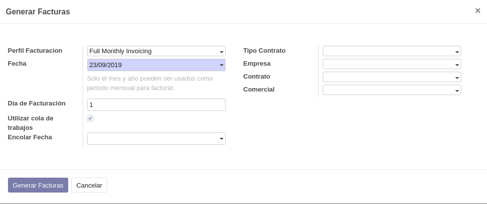

.. _procedure_factura:

################
Generar facturas
################

La generación de facturas de contratos ISP puede realizarse:

*  Mediante un proceso automático que se ejecuta en segundo plano.
   Por defecto, este proceso está desactivado.
   La facturación se realiza una vez al mes; el día del mes se configura
   en las opciones estándar de Odoo referentes a los procesos *cron*.

*  Mediante un asistente que se ejecuta de forma manual.

El proceso de facturación de contratos busca todas las líneas de contrato activas cuyo
campo :gui:`Fecha próxima factura` esté comprendido en el intervalo de fechas dado.
A continuación agrupa las líneas de contrato por contrato y genera una factura por cada contrato.

.. _procedure_factura_manual:

Facturación manual
==================

Para realizar una facturación manual, haga clic en el menú :xmenu:`ISP/Asistentes/Generar Facturas`.

El significado de los campos es el siguiente:

Perfil Facturación
   Seleccione uno de los :ref:`perfiles de facturación <procedure_factura_perfil>` existentes.
   Al seleccionar un perfil, se llenan los campos por defecto definidos en dicho perfil.

Fecha
   Especifique una fecha. Para el asistente de importación solamente tiene
   interés el mes y el año de esa fecha: a partir del mes y el año, construirá
   el intervalo de fechas entre el primer día y el último día del mes y año especificados.

Día de facturación
   Día del mes que tendrá la fecha de factura, en lugar del primer día de mes
   que toma por defecto.

Utilizar cola de trabajos
   Si se marca, la generación de facturas se realizará mediante el módulos
   de colas asíncronas de trabajos de Odoo (una factura por trabajo) que se
   ejecuta en segundo plano y permite liberar la interfaz de usuario.

Encolar fecha
   Este campo solo se muestra si se marca el campo :gui:`Utilizar cola de trabajos`.
   Indica la fecha y hora a partir de la cual se ejecutarán los procesos encolados.
   Un valor en blanco significa *inmediatamente*.

Tipo de contrato
   (Opcional) Especifique un :ref:`tipo de contrato <contrato_tipo>`, si desea
   restringir la generación de facturas a un tipo de contrato determinado.

Empresa
   (Opcional) Especifique una Empresa o cliente, si desea restringir la
   generación de facturas a un cliente concreto.

Contrato
   (Opcional) Especifique si desea restringir la facturación a un contrato
   determinado.

Comercial
   (Opcional) Especifique si desea restringir la facturación a los contratos
   con un Comercial determinado.

.. note::

   En los campos indicados como opcionales, un valor en blanco se considera
   que son *todos*.

Una vez haya especificado las opciones deseadas, haga clic en :gui:`Generar Facturas`.

.. _procedure_factura_cron:

Automatización
==============

La generación de facturas mediante procesos de ejecución en segundo plano (*cron*)
sigue el mismo procedimiento que la generación manual, pero al omitirse
la petición de opciones mediante un asistente, algunos valores los toma
del perfil de facturación. Estos valores son:

+  Día de facturación
+  Tipo de contrato
+  Empresa
+  Comercial

Los demás campos se definen del siguiente modo:

+  :gui:`Utilizar cola de trabajos`: **sí**
+  :gui:`Encolar fecha`: **inmediatamente** (en blanco)

.. _procedure_factura_perfil:

Perfiles de facturación
=======================

Permite definir distintos perfiles de facturación.
Estos perfiles se utilizan en la generación de facturas:

+  La generación automática seleccionará siempre el primer perfil activo de la lista
+  En la generación manual podrá seleccionarse cualquier perfil definido para
   incorporar sus valores por defecto.

En los perfiles de facturación se definen los siguientes campos:

Día de facturación
   Día del mes que se utilizará para la fecha de las facturas generadas.

Tipo de contrato
   Tipo de contrato al cual se restringirá la generación de facturas.

Empresa
   Empresa o cliente de contrato al cual se restringirá la generación de facturas.

Comercial
   Comercial de contrato al cual se restringirá la generación de facturas.
