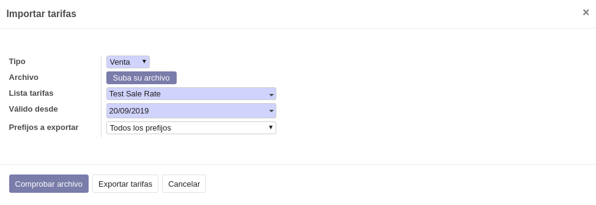
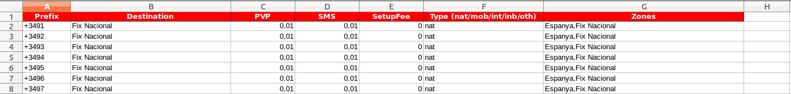

.. _procedure_rate:

###########################
Importar / exportar tarifas
###########################

La aplicación incluye un asistente para importar / exportar tarifas, tanto de venta
como de compra.

El asistente se encuentra en el menú :xmenu:`ISP/Asistentes/Importar tarifas`.

En este asistente puede realizar dos acciones:

*  Importar un archivo Excel que contenga tarifas.
*  Exportar tarifas actuales a un fichero Excel.

.. note::

   El formato de Excel soportado es **XLS**.

Exportar tarifas
----------------

La exportación de tarifas tiene 2 objetivos:

+  Exportar los precios de una tarifa para su revisión y análisis.

+  Generar un documento Excel que servirá como plantilla para su posterior importación.

Para exportar una tarifa o, más exactamente, una versión de tarifa:

+  En el campo :gui:`Tipo`, seleccione si desea trabajar con tarifas de venta o de compra.

+  En el campo :gui:`Lista tarifas`, seleccione la tarifa que desea exportar.

+  En el campo :gui:`Válido desde`, seleccione la fecha de vigencia de la tarifa.
   Es decir, se selecciona la versión de tarifa vigente en dicha fecha.

+  Opcionalmente, en el campo :gui:`Prefijos a exportar`, seleccione:

   +  Un tipo de prefijo
   +  La opción *Todos los prefijos*
   +  En blanco, solamente se generará un fichero Excel vacío (plantilla vacía)

+  Haga clic en :gui:`Exportar tarifas`.

Importar tarifas
----------------

Para importar una tarifa o, más exactamente, una versión de tarifa:

+  En el campo :gui:`Tipo`, seleccione si desea trabajar con tarifas de venta o de compra.

+  En el campo :gui:`Lista tarifas`, seleccione la tarifa que desea importar.

+  En el campo :gui:`Válido desde`, seleccione la fecha de vigencia de la nueva versión de tarifa.

   .. note::

      La importación crea una nueva versión con vigencia a partir de la fecha especificada en este campo
      y *cierra* la versión vigente anterior escribiendo una **fecha final** un día anterior
      a la fecha especificada en este campo.

+  Haga clic en :gui:`Comprobar archivo`.
   En este paso se comprueban los prefijos definidos en el fichero Excel y se crean
   los no existentes.

+  En la sección **Comprobar resultados** se muestra el resultado de la comprobación.

+  Haga clic en :gui:`Importar tarifas` para efectuar la importación.

Formato del fichero XLS
-----------------------

El formato del fichero **XLS** es como se muestra en la figura.

.. warning::

   La primera fila que corresponde a la cabecera debe ser **exactamente**
   igual a la mostrada en la figura. Por este motivo se recomienda exportar
   primero la tarifa para poder reutilizar el fichero.

Cada fila a partir de la segunda se corresponderá con un
:ref:`elemento de tarifa <tarifa_tarifa>`. Cree los elementos de tarifa necesarios.

Las columnas son las siguientes:

Prefix
   Prefijo al que se refiere el elemento de tarifa

   .. warning::

      Compruebe que la celda se edita en modo de texto.
      Añada un apóstrofo, si es necesario, para forzar que sea de tipo texto.
      De lo contrario, es posible que el programa de hoja de cálculo lo interprete
      como numérico y omita el signo `+` al guardar los datos.

Destination
   Texto descriptivo que se utiliza en el detalle de llamadas de las facturas.

PVP / PVD
   Precio lista del prefijo (elemento de tarifa).

   .. note::

      En las tarifas de venta, la cabecera de la columna será **PVP**,
      mientras que en las tarifas de compra será **PVD**.
      Respete en cada caso la cabecera de la columna.

SMS
   Precio unitario de cada SMS

SetupFee
   Precio de establecimiento de llamada.

Type
   Tipo del prefijo. Esta columna y la de destinación son necesarias
   ya que puede ser necesario crear el prefijo al importarse la tarifa.

   Debe ser **exactamente** uno de los siguientes tipos conocidos:

   +  `nat`, Fijo nacional
   +  `mob`, Móvil nacional
   +  `int`, Internacional
   +  `inb`, 900 Entrante
   +  `oth`, Red inteligente

Zones
   Zonas a las que se asignará este prefijo.
   Se trata de una lista de nombres de Zona, separadas por coma y sin espacios.
   Si la zona no existe, se creará. El prefijo se asociará a la zona o zonas
   definidas en esta columna.

   .. warning::

      El Nombre de una zona es un campo traducible.
      Para evitar que no se encuentre la zona cuando se busque por nombre,
      en la columna del archivo Excel debe utilizar nombres en el idioma
      de la sesión de Odoo con la que se importarán. Es decir, si en la
      columna Excel se escriben los nombres de Zona en castellano, la
      preferencia de idioma del usuario conectado al Odoo también deberá ser
      el idioma castellano.
