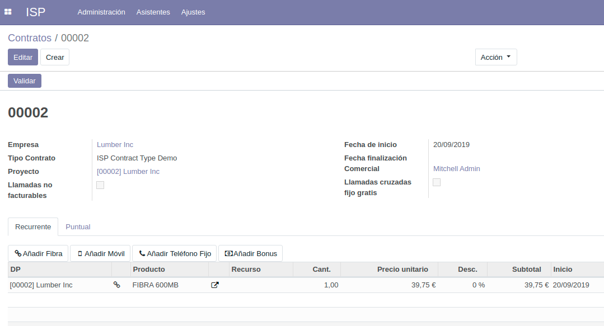
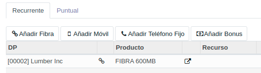
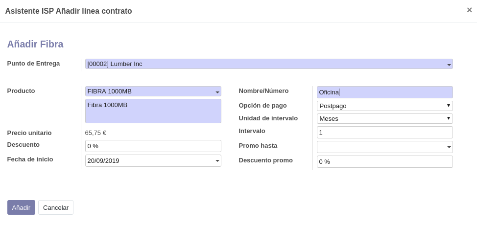
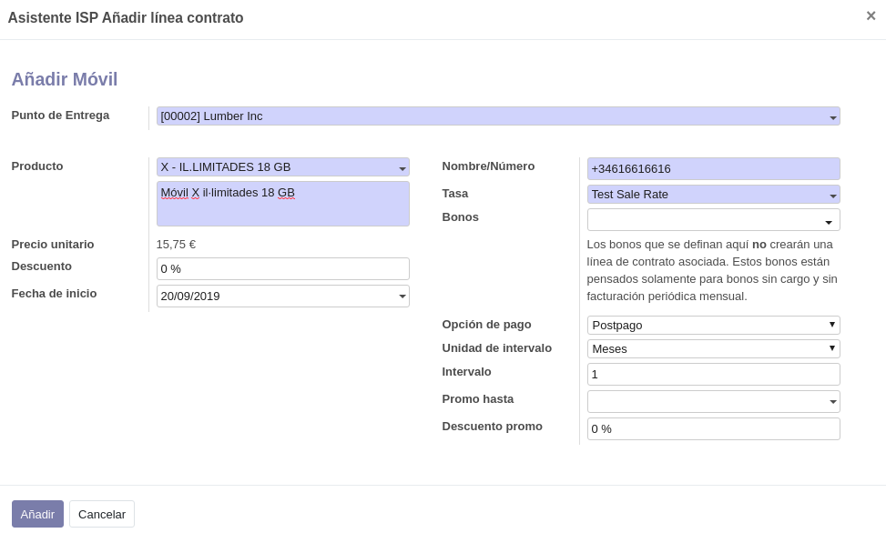
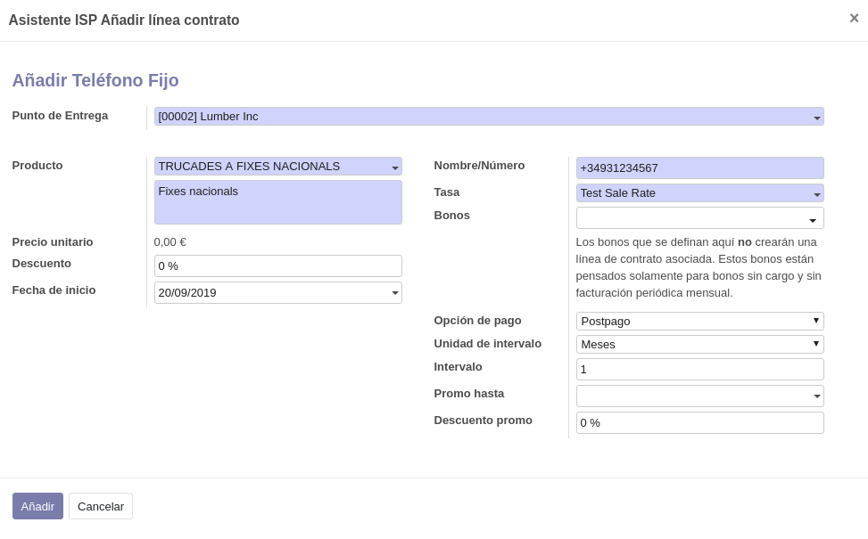
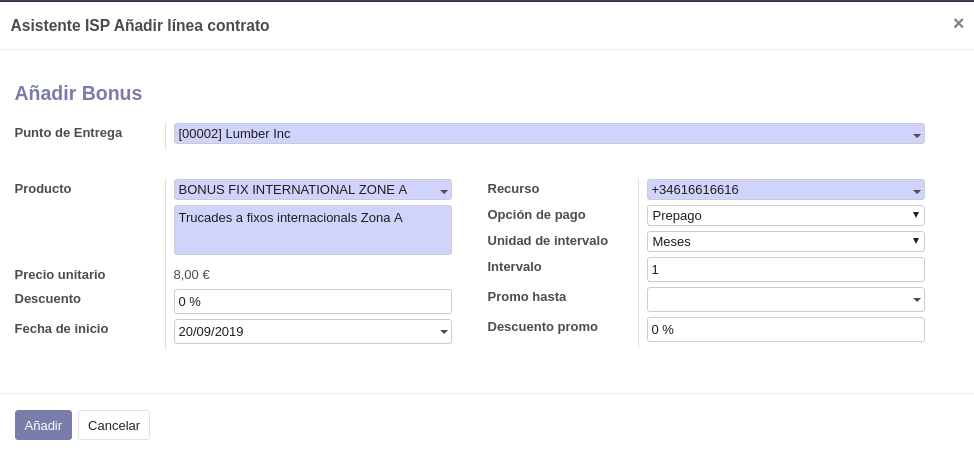
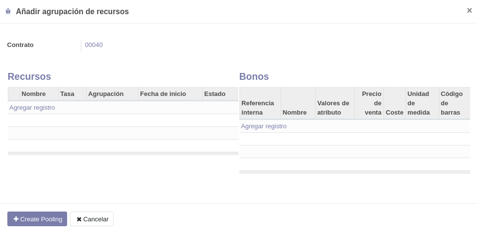
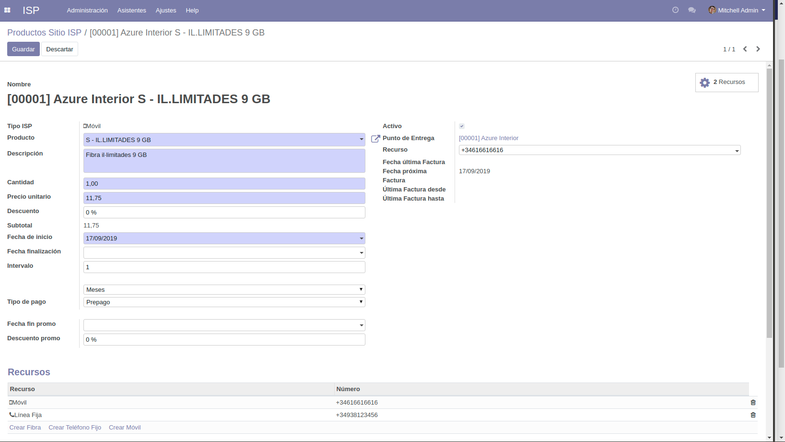

.. _procedure_recurso:

############################
Añadir recurso a un contrato
############################

Habitualmente, añadir una línea fija, un móvil, una fibra o un bono a un contrato
implica dos pasos:

*  Crear una :ref:`línea de contrato <contrato_linea>`, donde se definen los términos de la facturación periódica.
*  Crear un :ref:`recurso <contrato_recurso>`, donde se especifican el número de teléfono, tarifas, bonos, etc.

Estos asistentes facilitan la creación de estos dos pasos.

Si lo que desea es añadir un recurso **sin crear** una línea de contrato, es decir,
añadirlo a una línea de contrato existente, siga el procedimiento :ref:`procedure_recurso_sin`.

En la pantalla de Contrato:

pueden verse los botones para crear distintos recursos:

Haga clic en el botón del recurso que desee añadir.

:xfa:`chain` Añadir Fibra
-------------------------

Seleccione o especifique los siguientes campos:

Punto de Entrega
   Seleccione el punto de entrega al que desea asociar este recurso.

Producto
   Seleccione el producto que el cliente desea contratar. Solamente se muestran
   productos de tipo `Fibra`.

Fecha de inicio
   Indique la fecha de alta del servicio. Por defecto es la fecha de alta del contrato.

Nombre/número
   Especifique un nombre para la instalación de fibra. Por ejemplo, *Hogar* u *Oficina*.
   Aunque en la ficha del recurso ya exista un campo para ello, puede especificar
   un número de serie o cualquier otro dato técnico que facilite su identificación.

Opciones de pago y recurrencia
   Los valores mostrados son los valores por defecto especificados en la ficha de producto.

Promoción
   Si está sujeto a promoción, especifique las condiciones.

:xfa:`mobile` Añadir Móvil
--------------------------

Seleccione o especifique los siguientes campos:

Punto de Entrega
   Seleccione el punto de entrega al que desea asociar este recurso.

Producto
   Seleccione el producto que el cliente desea contratar. Solamente se muestran
   productos de tipo `Móvil`.

Fecha de inicio
   Indique la fecha de alta del servicio. Por defecto es la fecha de alta del contrato.

Nombre/número
   Especifique el número de teléfono (o un texto preliminar si aún no se conoce).
   Debe utilizarse la recomendación **E.176**, es decir, un signo `+` seguido
   del código internacional y del número local, sin espacios ni signos de puntuación.

Tarifa
   Especifique la :ref:`tarifa de ventas <tarifa_tarifa>` que se aplicará a las llamadas efectuadas por este recurso.

Bonos
   Especifique los posibles :ref:`bonos <tarifa_bono>` que desee aplicar a este recursos

   .. warning::

      Tal como se indica en la pantalla, los bonos que se definan aquí
      **no crearán** una línea de contrato asociada ni, en consecuencia,
      cargos mensuales. Estos bonos están pensados solamente para bonos
      sin cargo y sin facturación periódica mensual.

Opciones de pago y recurrencia
   Los valores mostrados son los valores por defecto especificados en la ficha de producto.

Promoción
   Si está sujeto a promoción, especifique las condiciones.

:xfa:`phone` Añadir Teléfono Fijo
---------------------------------

Seleccione o especifique los siguientes campos:

Punto de Entrega
   Seleccione el punto de entrega al que desea asociar este recurso.

Producto
   Seleccione el producto que el cliente desea contratar. Solamente se muestran
   productos de tipo `Línea fija`.

Fecha de inicio
   Indique la fecha de alta del servicio. Por defecto es la fecha de alta del contrato.

Nombre/número
   Especifique el número de teléfono (o un texto preliminar si aún no se conoce).
   Debe utilizarse la recomendación **E.176**, es decir, un signo `+` seguido
   del código internacional y del número local, sin espacios ni signos de puntuación.

Tarifa
   Especifique la :ref:`tarifa de ventas <tarifa_tarifa>` que se aplicará a las llamadas efectuadas por este recurso.

Bonos
   Especifique los posibles :ref:`bonos <tarifa_bono>` que desee aplicar a este recursos

   .. warning::

      Tal como se indica en la pantalla, los bonos que se definan aquí
      **no crearán** una línea de contrato asociada ni, en consecuencia,
      cargos mensuales. Estos bonos están pensados solamente para bonos
      sin cargo y sin facturación periódica mensual.

Opciones de pago y recurrencia
   Los valores mostrados son los valores por defecto especificados en la ficha de producto.

Promoción
   Si está sujeto a promoción, especifique las condiciones.

:xfa:`money` Añadir Bono
---------------------------------

Seleccione o especifique los siguientes campos:

Punto de Entrega
   Seleccione el punto de entrega al que desea asociar este recurso.

Producto
   Seleccione el producto que el cliente desea contratar. Solamente se muestran
   productos de tipo `Línea fija`.

Fecha de inicio
   Indique la fecha de alta del servicio. Por defecto es la fecha de alta del contrato.

Recurso
   Especifique el recurso (móvil o fijo existente en el contrato) al que se aplicará el bono.

Opciones de pago y recurrencia
   Los valores mostrados son los valores por defecto especificados en la ficha de producto.

Promoción
   Si está sujeto a promoción, especifique las condiciones.

:xfa:`asterisk` Añadir agrupación
---------------------------------

Seleccione o especifique los siguientes campos:

Recursos
   Especifique la lista de recursos que desea agregar a esta agrupación.
   Solamente podrán elegirse recursos que pertenezcan al contrato y
   que **no tengan asociados algún bono**.

Bonos
   Especifique la lista de bonos que se aplicarán al conjunto de recursos definidos en la agrupación.

.. note::

   En el proceso de creación de una factura, el funcionamiento de estos bonos es similar al
   de los bonos individuales. Se contemplan todas las llamadas efectuadas por los recursos agrupados
   y se aplican los bonos por orden de fecha, no por orden de recurso.

.. _procedure_recurso_sin:

Añadir recurso sin crear línea de contrato
------------------------------------------

Para añadir un recurso sin crear una línea de contrato, debe asignarlo
a una línea de contrato existente.

Seleccione la opción de menú :xmenu:`ISP/Administración/Líneas contrato/Recurrente`.

Se mostrará una lista de las líneas de contrato existentes.
Busque la línea donde desea añadir el recurso y selecciónela.
Edite la ficha:

En la parte inferior, en la sección :gui:`Recursos`, seleccione si desea:

*  Crear Fibra
*  Crear Teléfono Fijo
*  Crear Móvil

